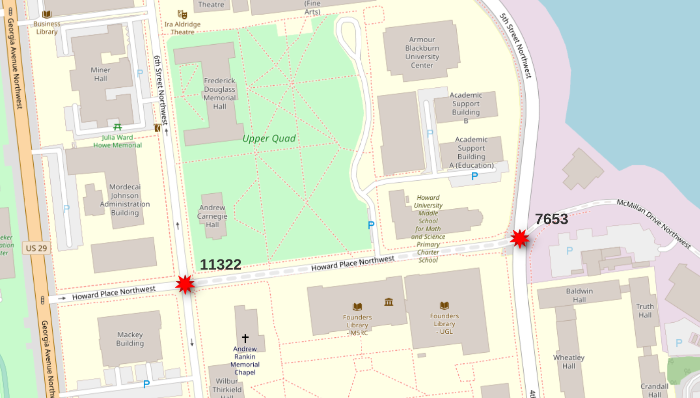
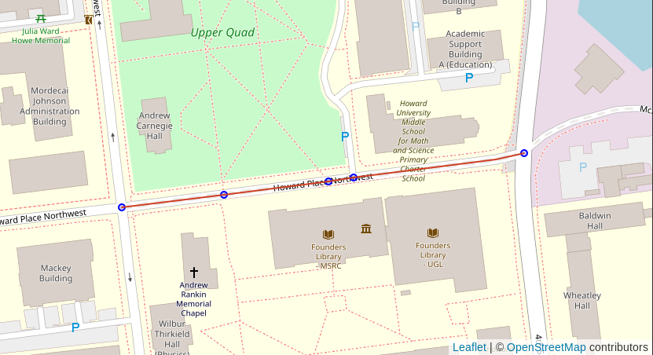
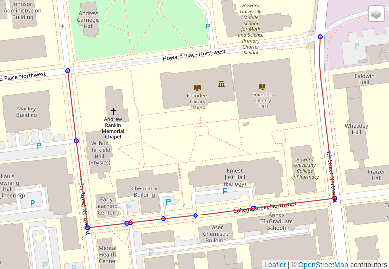

# Routing with PgOSM Flex

This page provides a simple example of using OpenStreetMap roads
loaded with PgOSM Flex for routing.
The example uses the D.C. PBF included under `tests/data/`.
See [MANUAL-STEPS-RUN.md](MANUAL-STEPS-RUN.md) for more details
on running PgOSM Flex w/out Docker.


```bash
osm2pgsql --slim --drop \
	--output=flex --style=./run-road-place.lua \
	-d $PGOSM_CONN \
	~/pgosm-data/district-of-columbia-2021-01-13.osm.pbf
```


## Prepare data

Create the `pgrouting` extension.

```sql
CREATE EXTENSION IF NOT EXISTS pgrouting;
```

Prepare roads for routing using pgrouting functions.

```sql
SELECT pgr_nodeNetwork('osm.road_line', .1, 'osm_id', 'geom');
SELECT pgr_createTopology('osm.road_line_noded', 0.1, 'geom');
SELECT pgr_analyzeGraph('osm.road_line_noded', 0.1, 'geom');
```

These commands create two (2) new tables usable by pgrouting.

* `osm.road_line_noded`
* `osm.road_line_noded_vertices_pgr`

Add simple `cost_length` column to the `osm.road_line_noded` table
as a generated column to use for routing costs.


```sql
ALTER TABLE osm.road_line_noded
    ADD cost_length DOUBLE PRECISION NOT NULL
    GENERATED ALWAYS AS (ST_Length(geom))
    STORED; 
```


## Start/end points

Picked vertex IDs `11322` and `7653`, they span a particular segment
of road that is tagged as `highway=residential` and `access=private`.
This was picked to illustrate how the calculated access control columns, `route_motor`, `route_cycle` and `route_foot`,
can influence route selection.


```bash
Name    |Value                 |
--------+----------------------+
osm_id  |6062791               |
osm_type|residential           |
name    |Howard Place Northwest|
access  |private               |
```




> See `flex-config/helpers.lua` functions (e.g. `routable_motor()`) for logic behind access control columns.


## Simple route

Using `pgr_dijkstra()` and no additional filters will
use all roads from OpenStreetMap without regard to mode of travel
or access rules.
This query picks a route that traverses the `access=private` section
of road.


```sql
SELECT d.*, n.the_geom AS node_geom, e.geom AS edge_geom
    FROM pgr_dijkstra(
        'SELECT id, source, target, cost_length AS cost,
                geom
            FROM osm.road_line_noded',
                     11322, 7653, directed := False
        ) d
    INNER JOIN osm.road_line_noded_vertices_pgr n ON d.node = n.id
    LEFT JOIN osm.road_line_noded e ON d.edge = e.id
;
```




## Route motorized

The following query modifies the query passed in to `pgr_dijkstra()`
to join to `osm.road_line`.  The join clause includes `route_motor`
which ensures sidewalks aren't chosen, as well as enforces simple
access control.


```sql
SELECT d.*, n.the_geom AS node_geom, e.geom AS edge_geom
    FROM pgr_dijkstra(
        'SELECT n.id, n.source, n.target, n.cost_length AS cost,
                n.geom
            FROM osm.road_line_noded n
            INNER JOIN osm.road_line r
            	ON n.old_id = r.osm_id
            		AND route_motor',
                     11322, 7653, directed := False
        ) d
    INNER JOIN osm.road_line_noded_vertices_pgr n ON d.node = n.id
    LEFT JOIN osm.road_line_noded e ON d.edge = e.id
;
```





