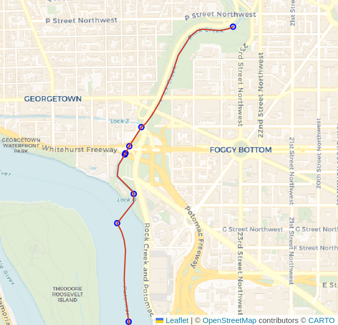

# Routing with Water

PgOSM Flex makes it easy to get started with routing with OpenStreetMap data
and pgRouting. The best experience is with pgRouting 4.0 and newer.
If you are using a pgRouting prior to 4.0 see
[Routing Roads: Legacy (pgRouting 3)](./routing-3.md).


## Prepare routing edge networks

You should have ran the steps in [Prepare for Routing](routing.md#prepare-for-routing)
before continuing.

----


PgOSM Flex includes functions to prepare routing edge networks for data in
`osm.water_line` by running the appropriate procedure.
These procedures can take a while to run on larger regions, see the Timing section
below for more details.

```sql
CALL osm.routing_prepare_water_network();
```


# Routing with Water

PgOSM Flex also includes a procedure to prepare a routing network using
the `osm.water_line` table.

```sql
CALL osm.routing_prepare_water_network();
```

Find the `vertex_id` for start and end nodes, similar to approach above
with roads.

```sql

WITH s_point AS (
SELECT v.id AS start_id, v.geom
    FROM osm.routing_water_vertex v
    INNER JOIN (SELECT
        ST_Transform(ST_SetSRID(ST_MakePoint(-77.050625, 38.908953), 4326), 3857)
            AS geom
        ) p ON v.geom <-> p.geom < 200
    ORDER BY v.geom <-> p.geom
    LIMIT 1
), e_point AS (
SELECT v.id AS end_id, v.geom
    FROM osm.routing_water_vertex v
    INNER JOIN (SELECT
        ST_Transform(ST_SetSRID(ST_MakePoint(-77.055645, 38.888747), 4326), 3857)
            AS geom
        ) p ON v.geom <-> p.geom < 200
    ORDER BY v.geom <-> p.geom
    LIMIT 1
)
SELECT s_point.start_id, e_point.end_id
        , s_point.geom AS geom_start
        , e_point.geom AS geom_end
    FROM s_point, e_point
;
```


Route, using the directional approach.

```sql
SELECT d.*, n.geom AS node_geom, e.geom AS edge_geom
    FROM pgr_dijkstra(
        'SELECT e.edge_id AS id
                , e.vertex_id_source AS source
                , e.vertex_id_target AS target
                , e.cost_length_forward AS cost
                , e.cost_length_reverse AS reverse_cost
                , e.geom
            FROM osm.routing_water_edge e
            ',
            :start_id, :end_id, directed := True
        ) d
    INNER JOIN osm.routing_water_vertex n ON d.node = n.id
    LEFT JOIN osm.routing_water_edge e ON d.edge = e.edge_id
;
```



## Challenge: Polygons with Water Routing

Waterway routing using lines only is often complicated by the nature of waterways
and the way routes flow through steams and rivers (lines) and also through ponds
and lakes (polygons). The data prepared by the above procedure only provides
the line-based functionality.

The following image ([source](https://blog.rustprooflabs.com/2022/10/pgrouting-lines-through-polygons))
visualizes the impact polygons can have on a line-only routing network for water routes.


See the [Routing with Lines through Polygons](https://blog.rustprooflabs.com/2022/10/pgrouting-lines-through-polygons)
blog post to explore one possible approach to solving this problem.

