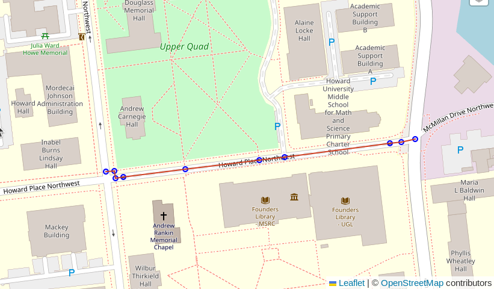
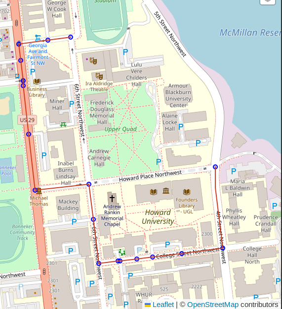

# Routing with PgOSM Flex

This page provides a simple example of using OpenStreetMap roads
loaded with PgOSM Flex for routing.
The example uses the D.C. PBF included under `tests/data/`.

```bash
cd ~/pgosm-data

wget https://github.com/rustprooflabs/pgosm-flex/raw/main/tests/data/district-of-columbia-2021-01-13.osm.pbf
wget https://github.com/rustprooflabs/pgosm-flex/raw/main/tests/data/district-of-columbia-2021-01-13.osm.pbf.md5
```

Loaded using `docker exec` command below for specific date.

```bash
docker exec -it \
    pgosm python3 docker/pgosm_flex.py \
    --ram=8 \
    --region=north-america/us \
    --subregion=district-of-columbia \
    --pgosm-date=2021-01-13
```


## Prepare data

Create the `pgrouting` extension.

```sql
CREATE EXTENSION IF NOT EXISTS pgrouting;
CREATE SCHEMA IF NOT EXISTS routing;
```

Prepare roads for routing using pgrouting functions.

```sql
CREATE TABLE routing.road_line AS
WITH a AS (
SELECT osm_id, osm_type, maxspeed, oneway, layer,
        route_foot, route_cycle, route_motor, access,
        ST_LineMerge(geom) AS geom
    FROM osm.road_line
), extra_cleanup AS (
SELECT osm_id, osm_type, maxspeed, oneway, layer,
        route_foot, route_cycle, route_motor, access,
        (ST_Dump(geom)).geom AS geom
    FROM a 
    WHERE ST_GeometryType(geom) = 'ST_MultiLineString'
), combined AS (
SELECT osm_id, osm_type, maxspeed, oneway, layer,
        route_foot, route_cycle, route_motor, access,
        geom
    FROM a
    WHERE ST_GeometryType(geom) != 'ST_MultiLineString'
UNION
SELECT osm_id, osm_type, maxspeed, oneway, layer,
        route_foot, route_cycle, route_motor, access,
        geom
    FROM extra_cleanup
    WHERE ST_GeometryType(geom) != 'ST_MultiLineString'
)
SELECT ROW_NUMBER() OVER (ORDER BY geom) AS id, *
    FROM combined
    ORDER BY geom
;

```


```sql
SELECT pgr_nodeNetwork('routing.road_line', .1, 'id', 'geom');
SELECT pgr_createTopology('routing.road_line_noded', 0.1, 'geom');
SELECT pgr_analyzeGraph('routing.road_line_noded', 0.1, 'geom');
```

These commands create two (2) new tables usable by pgrouting.

* `routing.road_line_noded`
* `routing.road_line_noded_vertices_pgr`

Add simple `cost_length` column to the `routing.road_line_noded` table
as a generated column to use for routing costs.


```sql
ALTER TABLE routing.road_line_noded
    ADD cost_length DOUBLE PRECISION NOT NULL
    GENERATED ALWAYS AS (ST_Length(geom))
    STORED; 
```

> Note: This is for non-directional routing.  See the *Routing `oneway`* section below for more on directional routing.


## Start/end points

The following query identifies the vertex IDs for a start and end point to use
for later queries.  Use the `start_id` and `end_id` values from this query
in subsequent queries.


```sql
WITH s_point AS (
SELECT v.id AS start_id
    FROM routing.road_line_noded_vertices_pgr v
    INNER JOIN (SELECT
        ST_Transform(ST_SetSRID(ST_MakePoint(-77.0211, 38.92245), 4326), 3857)
            AS geom
        ) p ON v.the_geom <-> geom < 10
    ORDER BY v.the_geom <-> geom
    LIMIT 1
), e_point AS (
SELECT v.id AS end_id
    FROM routing.road_line_noded_vertices_pgr v
    INNER JOIN (SELECT
        ST_Transform(ST_SetSRID(ST_MakePoint(-77.0183, 38.9227), 4326), 3857)
            AS geom
        ) p ON v.the_geom <-> geom < 10
    ORDER BY v.the_geom <-> geom
    LIMIT 1
)
SELECT s_point.start_id, e_point.end_id
    FROM s_point, e_point
;
```

```
┌──────────┬────────┐
│ start_id │ end_id │
╞══════════╪════════╡
│    14630 │  14686 │
└──────────┴────────┘
```

Picked vertex IDs `14630` and `14686`, they span a particular segment
of road that is tagged as `highway=residential` and `access=private`.
This was picked to illustrate how the calculated access control columns, `route_motor`, `route_cycle` and `route_foot`,
can influence route selection.

> Note:  The vertex IDs in my test database will not necessary match the vertex IDs in your database!

```sql
SELECT *
    FROM osm.road_line
    WHERE osm_id = 6062791
;
```


> See `flex-config/helpers.lua` functions (e.g. `routable_motor()`) for logic behind access control columns.


## Simple route

Using `pgr_dijkstra()` and no additional filters will
use all roads from OpenStreetMap without regard to mode of travel
or access rules.
This query picks a route that traverses the `access=private` section
of road.


```sql
SELECT d.*, n.the_geom AS node_geom, e.geom AS edge_geom
    FROM pgr_dijkstra(
        'SELECT id, source, target, cost_length AS cost,
                geom
            FROM routing.road_line_noded
            ',
            14630, 14686, directed := False
        ) d
    INNER JOIN routing.road_line_noded_vertices_pgr n ON d.node = n.id
    LEFT JOIN routing.road_line_noded e ON d.edge = e.id
;
```




## Route motorized

The following query modifies the query passed in to `pgr_dijkstra()`
to join to `osm.road_line`.  The join clause includes a filter on
the `route_motor` column.


```sql
SELECT d.*, n.the_geom AS node_geom, e.geom AS edge_geom
    FROM pgr_dijkstra(
        'SELECT n.id, n.source, n.target, n.cost_length AS cost,
                n.geom
            FROM routing.road_line_noded n
            INNER JOIN routing.road_line r ON n.old_id = r.id
                    AND r.route_motor
            ',
            14630, 14686, directed := False
        ) d
    INNER JOIN routing.road_line_noded_vertices_pgr n ON d.node = n.id
    LEFT JOIN routing.road_line_noded e ON d.edge = e.id
;
```


## Route `oneway`

The `oneway` column in the road tables uses
[osm2pgsql's `direction` data type](https://osm2pgsql.org/doc/manual.html#type-conversions) which resolves to `int2` in Postgres.
Valid values are:

* `0`: Not one way
* `1`: One way, forward travel allowed
* `-1`: One way, reverse travel allowed
* `NULL`: It's complicated. See #172.


Assuming a noded roads table routing table, bring over the `oneway` detail

```sql
ALTER TABLE routing.road_line_noded
    ADD oneway INT2 NULL
;

UPDATE routing.road_line_noded rn
    SET oneway = r.oneway
    FROM routing.road_line r
    WHERE rn.old_id = r.id AND rn.oneway IS NULL
;
```

### Forward and reverse costs

Calculate forward cost.

```sql
ALTER TABLE routing.road_line_noded
    DROP COLUMN IF EXISTS cost_length
;

-- Cost with oneway considerations
ALTER TABLE routing.road_line_noded
    ADD cost_length NUMERIC
    GENERATED ALWAYS AS (
        CASE WHEN oneway IN (0, 1)
                THEN ST_Length(geom)
            WHEN oneway = -1
                THEN -1 * ST_Length(geom)
            END
    )
    STORED
;
```

Reverse cost.

```sql
-- Reverse cost with oneway considerations
ALTER TABLE routing.road_line_noded
    ADD cost_length_reverse NUMERIC
    GENERATED ALWAYS AS (
        CASE WHEN oneway IN (0, -1)
                THEN ST_Length(geom)
            WHEN oneway = 1
                THEN -1 * ST_Length(geom)
            END
    )
    STORED
;
```

### New undirected route

Found new start point slightly to the north that will require one-way aware
for proper routing. The route from this query incorrectly goes the wrong
way on 6th Street Northwest.

```sql
SELECT d.*, n.the_geom AS node_geom, e.geom AS edge_geom
    FROM pgr_dijkstra(
        'SELECT n.id, n.source, n.target, n.cost_length AS cost,
                n.cost_length_reverse AS reverse_cost,
                n.geom
            FROM routing.road_line_noded n
            INNER JOIN osm.road_line r
                ON n.old_id = r.id
                    AND route_motor
                    AND n.cost_length IS NOT NULL
        ',
          14624, 14686,
          directed := False
        ) d
    INNER JOIN routing.road_line_noded_vertices_pgr n ON d.node = n.id
    LEFT JOIN routing.road_line_noded e ON d.edge = e.id
;
```


### Directed

Route, now directed. This respects the one-way rules.


```sql
SELECT d.*, n.the_geom AS node_geom, e.geom AS edge_geom
    FROM pgr_dijkstra(
        'SELECT n.id, n.source, n.target, n.cost_length AS cost,
                n.cost_length_reverse AS reverse_cost,
                n.geom
            FROM routing.road_line_noded n
            INNER JOIN routing.road_line r
                ON n.old_id = r.id
                    AND route_motor
                    AND n.cost_length IS NOT NULL
        ',
          14624, 14686,
          directed := True
        ) d
    INNER JOIN routing.road_line_noded_vertices_pgr n ON d.node = n.id
    LEFT JOIN routing.road_line_noded e ON d.edge = e.id
;
```


